# TUGAS 1 IF3110 PENGEMBANGAN APLIKASI BERBASIS WEB
# Engima

## Deskripsi Aplikasi Web
Saat ini Engi ingin melakukan ekspansi usaha dengan membangun sebuah bioskop. Setelah berdiri selama 2 bulan, Engi merasa bioskopnya sepi dibanding bioskop kompetitor lainnya. Usut punya usut, ternyata faktor utama penyebab sepinya bioskop Engi adalah tidak adanya kemudahan pemesanan tiket secara daring. Oleh karena itu, Engi meminta Anda untuk membuat aplikasi web pemesanan tiket bioskop daring. Engi menginginkan website miliknya untuk memiliki fitur pembelian tiket, memberi ulasan pada film yang telah ditonton, login dan register, riwayat pembelian tiket.

Engi telah mempekerjakan seorang UI/UX profesional untuk mendesain tampilan *website*-nya. Anda diminta untuk mengimplementasikan tampilan sedemikian mirip dengan tampilan pada contoh. Engi tidak meminta Anda untuk membangun *website* yang *responsive*. Icon dan jenis font tidak harus sama dengan contoh. Tata letak elemen, warna font, garis pemisah, dan perbedaan ukuran font harus terlihat sesuai contoh. Format rating dan waktu harus terlihat sesuai contoh tampilan.

## Daftar *requirement*
- Pada halaman **Registrasi** pengguna diwajibkan mengisi seluruh field yang ada.
- *username*,*email*, dan *nomor hp* yang ingin didaftarkan wajib belum terdaftar pada *database* website.
- *email*, *username*, dan *nomor hp* yang diisi harus **UNIK**
- Jika unik, border *field* akan berwarna hijau. Jika tidak unik, *field* akan diberikan pesan error berwarna merah.
- Email sesuai memiliki format email standar seperti **“user@mail.com***.
- Username hanya menerima kombinasi alphabet, angka, dan *underscore*.
- Nomor HP hanya menerima angka dengan panjang antara 9-12 angka.
- Pada halaman **Home**, pengguna disambut dengan "Hello, *username*" dan daftar film yang sedang tayang.
- Pada halaman **Search Result**, untuk setiap film, ditampilkan informasi judul, sinopsis, rating, poster. Pengguna dapat melihat detail film dengan mengklik tombol “View details”.
- Ketika memilih *page*, pengguna tidak diarahkan ke halaman baru namun daftar film langsung berubah di halaman search saat itu.
- Pada halaman **Film Detail** terdapat beberapa informasi mengenai film yang dipilih, yaitu judul, poster, rating, genre (bisa lebih dari satu), tanggal rilis, durasi tayang (dalam menit), dan sinopsis dari film tersebut.
- Pengguna dapat melakukan pembelian tiket dari halaman ini dengan memilih salah satu dari *schedule* pada tabel *schedule* yang tersedia.
- Pengguna dapat melihat *Top 3 review* dari pengguna lain yang pernah menonton film tersebut. *Review* tersebut terdiri atas foto profil pengguna, *username* pengguna, *rating* dalam skala 1-10, dan ulasan dari film tersebut.
- Pada halaman **Buy Ticket**, pengguna dapat memilih salah satu kursi yang ingin dipesan (**tepat 1 kursi saja**) kemudian mengklik tombol *Buy Ticket* bila sudah milih kursi yang diinginkan.
- Setelah mengklik tombol *Buy Ticket*, pengguna akan disodorkan tambilan *Payment Success* dan dapat mengklik tombol *Show Transaction History* untuk menuju ke catatan pembelian tiket pengguna.
- Pada halaman **Transaction History**, pengguna dapat melihat list tiket film yang pernah dibeli. Bila waktu tayang film belum lewat maka pengguna belum bisa memberikan review. Bila sudah lewat waktu tayang, pengguna dapat memberikan review dan dapat mengubah atau menghapus review yang pernah diberikan.
- Pada halaman **User Review**, pengguna dapat memberikan review film yang pernah ditonton dengan skala 1-10 dan memberikan komentar untuk review.

# Cara Instalasi
1. Install mySql versi terbaru.
2. Install XAMPP.
3. Clone Repository ini dan taruh di folder htdocs XAMPP (e.g: opt/lampp/htcdocs).

# Cara Menjalankan Server
1. `sudo ./lampp start`
2. Buka di browser `localhost/tugas-besar-1-2019/public`

# *Screenshoot* Tampilan Aplikasi
1. Login:
    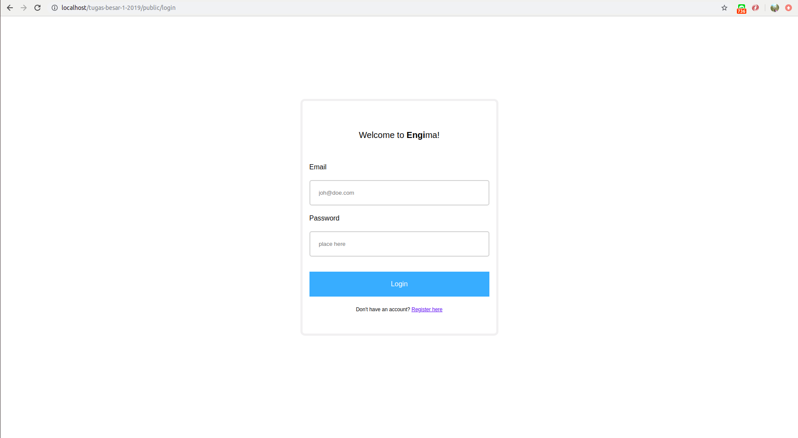
2. Register: 
   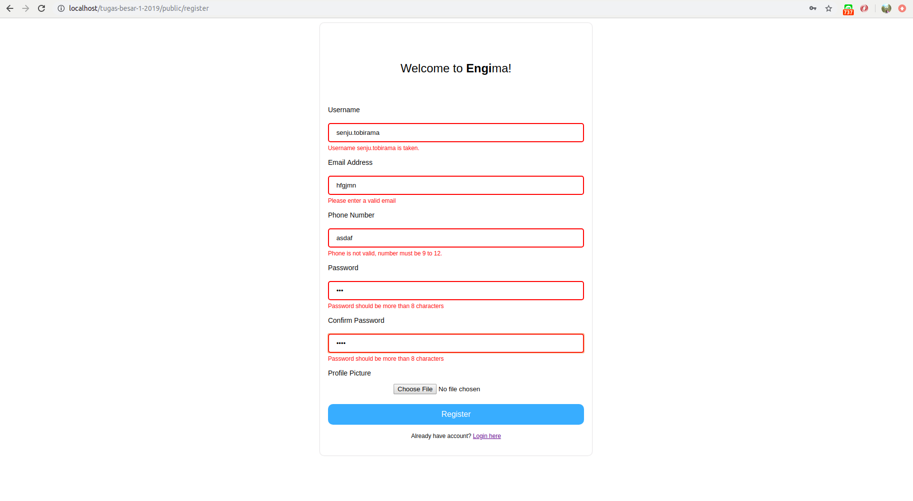
   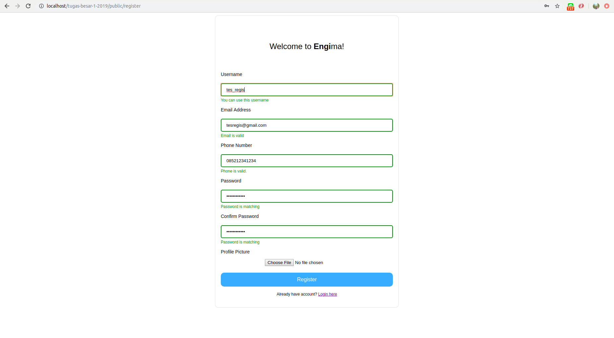
3. Logout: -
4. Home: 
   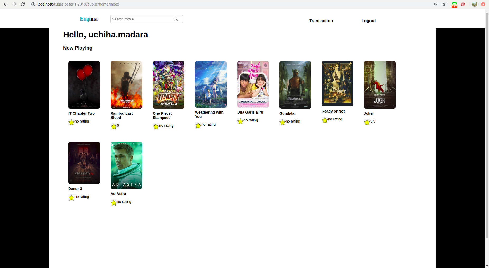
5. Detail:
   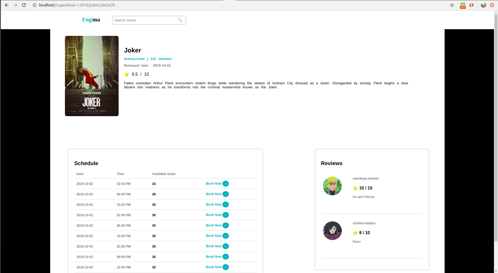
6. Booking:
  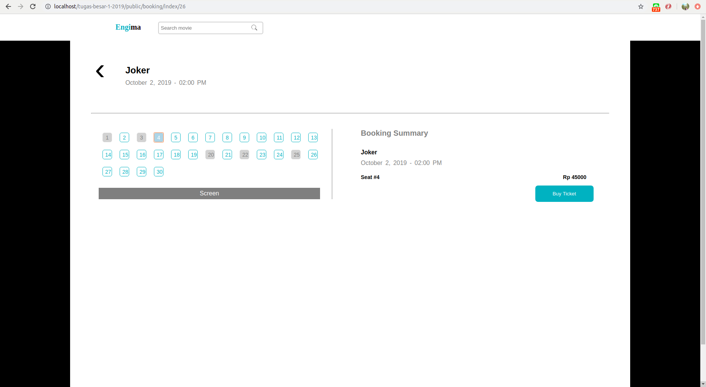
  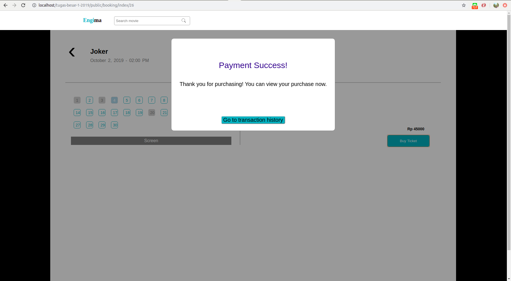
7. Search: 
  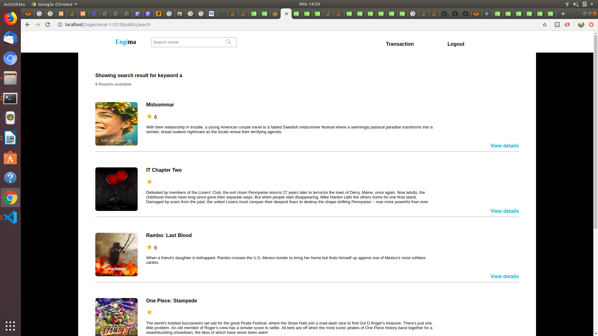
8. Transaction:
  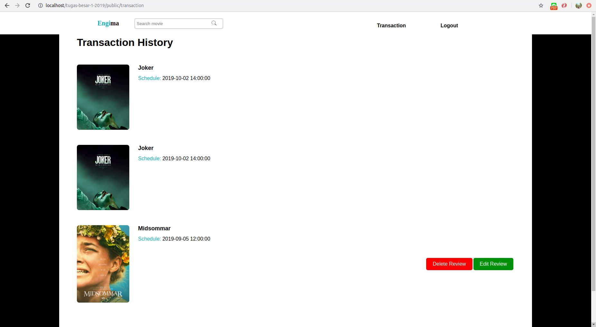
  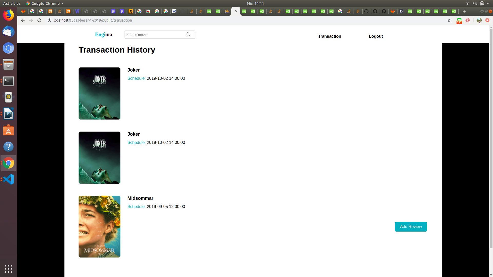
9. Review: 
  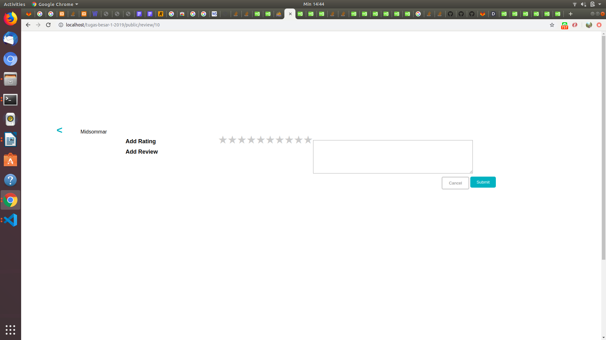

# Pembagian Tugas
## Frontend
1. Login: 13517018
2. Register: 13517018
3. Logout: -
4. Home: 13517018
5. Detail: 13517024
6. Booking: 13517018, 13517024
7. Search: 13517042
8. Transaction: 13517018, 13517042
9. Review: 13517042

## Backend
1. Login: 13517024
2. Register: 13517024 
3. Logout: 13517024
4. Home: 13517018
5. Detail: 13517018, 13517024
6. Booking: 13517024
7. Search: 13517042
8. Transaction: 13517018, 13517042
9. Review: 13517018, 13517024, 13517042